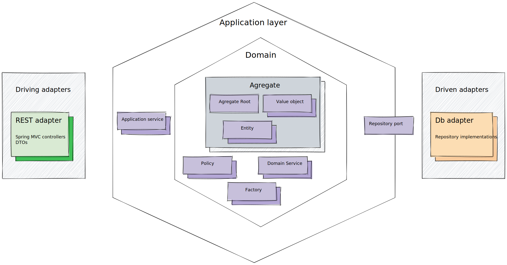
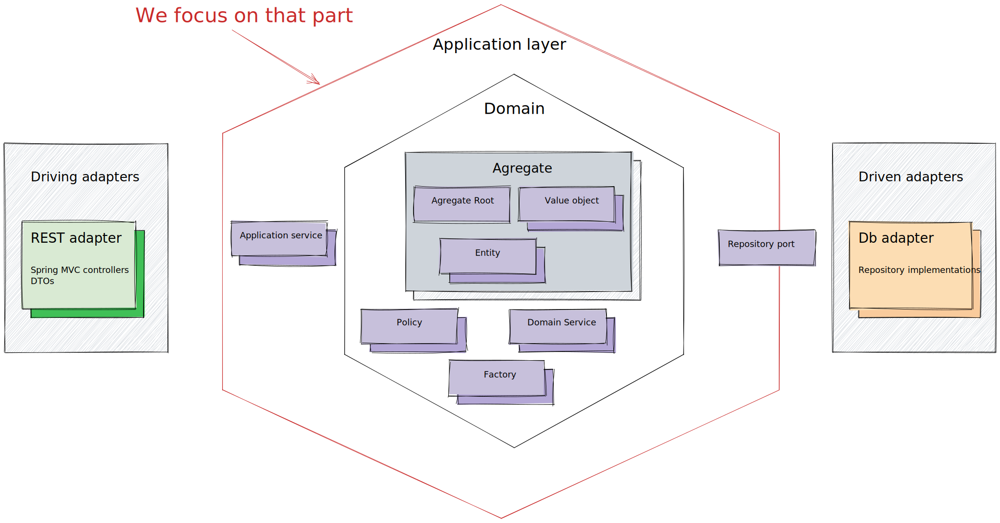
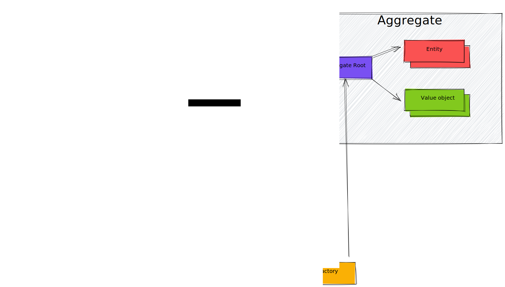
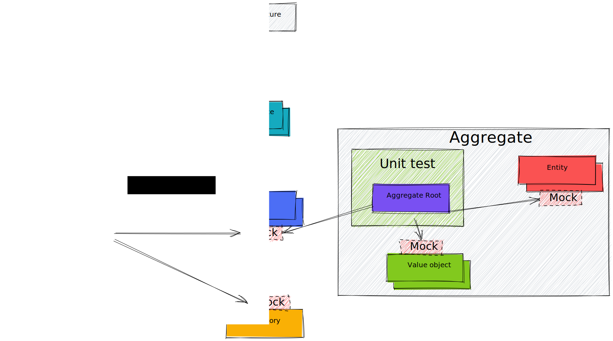
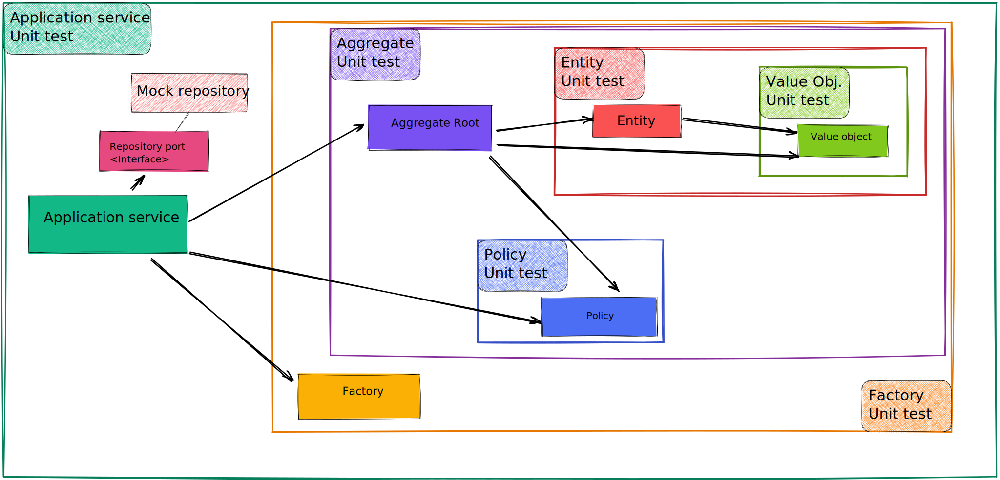
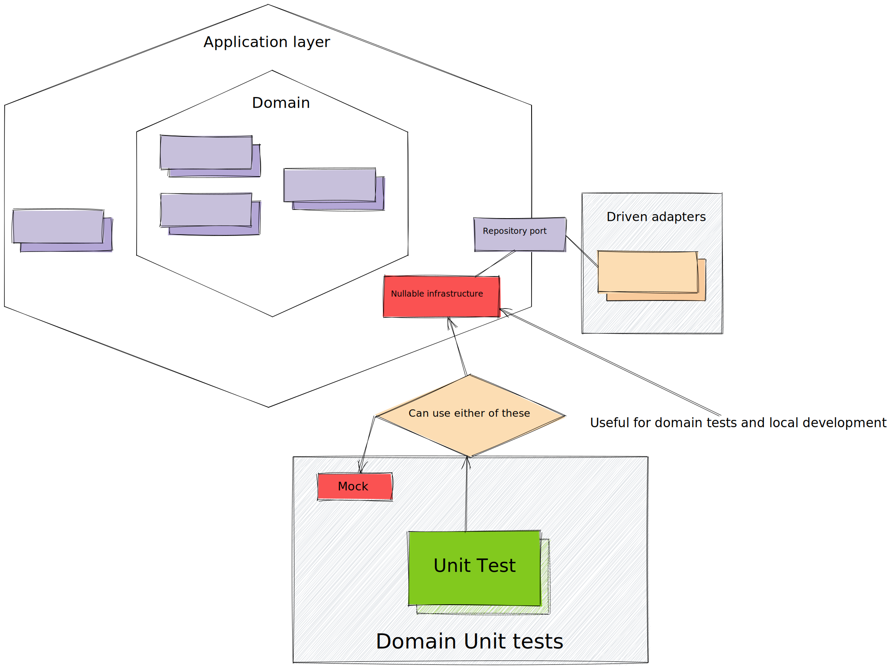

#  The Benefits of Overlapping Sociable Tests in Domain Testing

## Introduction

In this article, I want to discuss some challenges which can 
come up when testing domain logic. More precisely, I will
concentrate on potential problems which can occur in projects 
with complex business domain.

Testing is a broad topic with many nuances, so here I will 
only focus on a single 
pattern called "Sociable Unit Testing."
While it may not be as widely recognized, it can still 
serve as a valuable alternative to traditional unit tests.
However, 
like with many things, there is no one-size-fits-all 
solution which can solve all problems. We need to consider the drawbacks.
The key is to choose the appropriate method 
for the specific use case and be mindful of the trade-offs. 
This can be achieved by a thorough analysis of the pros and 
cons of a given approach and, more importantly, 
through understanding of how the chosen solution aligns with 
the specific use case.


## Potential Issues

As the codebase grows, some solutions that were once sufficient
may become difficult to maintain. For instance, in a project
where new requirements are frequently being added, and existing code
is often modified, maintaining tests can become a challenge. 
When there are many solitary unit tests, changing the code
may require updating a large number of such tests.
This can occur when most unit tests are fully isolated, 
meaning they are completely separated from surrounding 
dependencies and only interact with mocks.

Solitary tests approach allows us to create independent 
tests, but it comes at a significant cost. We must write and 
maintain mocks and their contracts, which can become 
overwhelming as the number of tests and code changes increase.
Additionally, having too many isolated tests can lead to another
issue, that is, keeping mocks up to date. 
It takes a lot of discipline and understanding of the 
current code to spot inconsistencies in a frequently 
changing codebase, and when these inconsistencies occur, 
it means that our tests no longer accurately reflect the 
real logic.

It is worth to highlight that creating new tests is 
time-consuming process.
As mentioned before, writing isolated tests requires 
creating an independent environment, 
and each time mocks must be prepared for such tests.

## Goals

The requirements of a project can vary, and different solutions 
may be appropriate for different scenarios. 
Some patterns may work well for complex domains but can be an 
overkill for simpler domains (e.g. infrastructure focused applications).
In my opinion, the approach of sociable testing is better suited 
for systems with complex domains. However, it should be noted 
that this approach may not be limited to this specific scenario.

In the context of complex domain application we should consider these three aspects:

- **Simplify The Maintenance.** You can do it by reducing the number of mocks and stubs contracts, leading to fewer configurations and updates on a single test level.
- **Strengthen Reliability.** Use real code interactions instead of inconsistent mock contracts.
- **Improve Performance.** Reduce the need for initializing context for each test and use shared configuration whenever possible.


## Hexagonal Architecture and Domain-Driven Design

Examples given in this text are implemented in Java and Spring Boot
framework. Additionally, I applied the Hexagonal Architecture as a
method of code arrangement and Domain-Driven Design (DDD), as it
can be a good fit for cases with complex business logic. However, I don't want to delve
too deeply into these specific concepts, as they are alternative 
approaches and sociable tests can also be effectively applied to 
more traditional methods.
For more information on these topics, you can easily find resources online.
<figure>

<figcaption align = "center"><b>Fig. 1. Hexagonal Architecture Overview</b></figcaption>
</figure>

Furthermore, I want to focus only on testing the domain and application layers.

<figure>

<figcaption align = "center"><b>Fig. 2. Hexagonal Architecture Focus</b></figcaption>
</figure>


## Solitary vs. Sociable Tests

In the case of solitary tests, mocks are typically required 
at some point. When using DDD, the domain is often complex, and our logic will have many 
relationships. 

For example, a solitary test for application service
will likely become a mock ceremony.
This results in spending a lot of time and energy on
creating and maintaining mocks, rather than focusing on 
testing the core logic of the service.

```


public class OrderService {

   private final ClientProvider clientProvider;
   private final OrderAccessPolicy orderAccessPolicy;
   private final OrderRepository orderRepository;

   /**
    * Create order with empty product basket
    * Add products to order
    * Get Client
    * Check if client can make an order according to given policies
    * Place order
    */
   public Order placeOrder(@NonNull List<Product> products, @NonNull String clientId) {
      Order order = Order.init(clientId);
      order.add(products);

      clientProvider.fetchClient(clientId)
            .ifPresentOrElse(client -> placeOrderForClient(order, client), () -> handleNotExistentClient(clientId));

      return orderRepository.save(order);
   }

   private void placeOrderForClient(Order order, Client client) {
      order.place(client, orderAccessPolicy).getOrElse(() -> handleOrderPlacementFailure(order));
   }

   private Order handleOrderPlacementFailure(Order order) {
      order.reject();
      return order;
   }

   private void handleNotExistentClient(String clientId) {
      throw new ClientAccessException(String.format("Client with given id %s not found!", clientId));
   }

}

```

```
@ExtendWith(MockitoExtension.class)
class SolitaryOrderServiceTest {
   @Mock
   private ClientProvider clientProvider;
   @Mock
   private OrderAccessPolicy orderAccessPolicy;
   @Mock
   private OrderRepository orderRepository;

   @InjectMocks
   private OrderService orderService;

   @Test
   void shouldPlaceValidOrder() {
      UUID id = UUID.randomUUID();
      try (MockedStatic<UUID>  mockedUUID = mockStatic(UUID.class)) {
         // given
         mockedUUID.when(UUID::randomUUID).thenReturn(id);

         String productId = "product1";
         int amount = 2;
         String clientId = "client1";
         Order intermediateOrder = Order.init(clientId);
         List<Product> products = List.of(new Product(productId, amount));
         intermediateOrder.add(products);

         Order finalOrder = Order.init(clientId);
         finalOrder.add(products);
         ReflectionTestUtils.setField(finalOrder, "status", Order.Status.PLACED);


         Client client = new Client(clientId, false);

         // when
         when(clientProvider.fetchClient(clientId)).thenReturn(Optional.of(client));
         when(orderAccessPolicy.check(intermediateOrder, client)).thenReturn(Either.right(true));
         when(orderRepository.save(finalOrder)).thenReturn(finalOrder);
         Order result = orderService.placeOrder(products, clientId);

         // then
         assertThat(result).isNotNull();
         assertThat(result.getId()).isNotBlank();
         assertThat(result.getId()).isEqualTo(id.toString());
         verify(clientProvider).fetchClient(clientId);
         verify(orderAccessPolicy).check(finalOrder, client);
         verify(orderRepository).save(finalOrder);
      }
   }
    ...
}

```

In the above example, we had to mock a few services and the static UUID method.
Of course static mock could be avoided by separating the UUID service provider and mocking it in our test.
However, this would still require further mock configurations.
Additionally, in this example, our mocks were strict, as we attempted to verify exact matches.
This often becomes too tedious, leading us to opt for more generic mock setups using helper methods like `any()`.
While this makes mock configuration easier, it also reduces the reliability and accuracy of our tests.

This was a simple example, 
in many cases there would be more dependencies in 
that layer. However, it is important to test the 
application layer as well. 
Even though there should not be any business 
logic here, only orchestration responsible for 
delegation to the domain, there are still 
interactions between aggregates. Therefore, 
we want to know if our code correctly 
delegates logic between those aggregates and any 
external systems.


The same holds true for mocking different policies or
Value Objects that interact with each other within 
an aggregate. 


<figure>

<figcaption align = "center"><b>Fig. 3. DDD Relationships</b></figcaption>
</figure>


<figure>

<figcaption align = "center"><b>Fig. 4. Solitary Tests In Case of DDD</b></figcaption>
</figure>

For that reason, it may be more practical to change the 
approach and within the domain module apply sociable tests.
This means using real dependencies during unit tests, 
rather than mocking everything around. 
By doing this, we can focus on a single unit like a class,
but interact with reliable and real code. 
This approach helps reduce the amount of mock configuration. 
For example, our test for the `OrderService` class will have
fewer mocks. Additionally, the test will be more reliable,
because we will test real domain code and how it influences
orchestration. In comparison, in the previous approach,
it was easier to get out of date with our mocks, 
in the sense that the mocks may not reflect the 
current state of the system, therefore leading to 
unreliable tests.

Furthermore, we can reuse our dependencies in other tests,
for example, by reusing the Spring Context, we can 
initialize `ProductAccessPolicy` only once.

Although this approach seems to be quite practical, it
has some issues. For that reason, we have to address a
few problems to avoid unnecessary
complications in later stages.

### Overlapping Tests
Firstly, in case of sociable tests, to some extent, 
our tests become redundant. It means that by testing 
the application service, we implicitly test our domain. 
Similarly, by testing the aggregate root, we may interact 
with other inner classes within the aggregate like entities,
value objects or policies. It may create cascade failures 
in our tests. For example, a small bug in our value object 
logic will produce fails in multiple tests which use this
class. It is not necessarily a bad thing, but it can lead 
to confusion, and it makes it harder to spot the source 
of the problem. 

That's why it is useful to design our 
tests in the form of overlapping sociable tests. 
It means that we start testing our code beginning 
from the most basic, independent units and then gradually
expand our tests to cover more advanced classes that
interact with previously tested dependencies. 

Thanks to that method, in case of a bug, we can 
start fixing our code beginning from the most basic 
unit that failed. It is very probable that a single
fix in such a class will automatically fix the rest of 
our tests.

<figure>

<figcaption align = "center"><b>Fig. 5. Overlapping Tests</b></figcaption>
</figure>

As shown in the picture above, we have the basic unit
test for a value object, which is 
then used by the entity, aggregate, and so on.

### Easily Visible Behavior

Another thing that can improve our tests is the idea of easily visible behavior. In order to effectively test our unit of code, we do not want to look inside that code. With mocks, it is tempting to prove validity using mock verification. In our approach, we try to avoid that because it is hard to maintain in the long run. When changes occur inside our code, we will be forced to rewrite our tests. Instead of doing that, it is better to write the code in such a way that it is easy to check the behavior by using the returned data from the tested method or by using some publicly accessible getters.

```

public interface ProductAccessPolicy {
   Either<ProductAccessException, Boolean> check(Product product, Client client);
}

```

Here, policies can be implemented as pure functions, and we are able to check behavior only by checking the returned value.

In the case of aggregates, we often have some mutating procedures on them. In that case, supplying a public method that can tell us how the state of the aggregate looks like, can be a valid solution. This way we can easily check the behavior of our aggregate without having to look inside the code.

```
public class Order {
   
   ...
   
   public void add(List<Product> newProducts) {
      if (isOrderActive()) {
         products.addAll(newProducts);
      }
   }

   public Either<ProductAccessExceptions, Order> place(Client client, OrderAccessPolicy accessPolicy) {
      return accessPolicy.check(this, client).map(this::orderSuccessfullyPlaced);
   }
}
```

In the above case, a simple `add(...)` method not only
appends a record to a list, it changes the state of our
aggregate and, at the same time, affects our business 
rules. Although it returns nothing, we can still 
validate our logic using the `place(...)`
method available for our aggregate and check whether it 
works as expected. This form of assertion is 
more focused on the domain. Instead of examining the technical 
internals of our aggregate, we aim to validate it by verifying real business behaviors.

### Collaborator Based Isolation

When writing sociable unit tests, it's important to think about 
how changes in the system might affect our test assertions.
We can reduce the amount of updates needed for unrelated tests 
by using actual data returned from the dependencies that we 
interact with during the test, instead of manually coding expected results.
This approach can help us keep our tests more maintainable
in the long run. 

Let's look at given method:

```
   public String renderReport() {
      return String.format("Order report:%n %s",products.stream().map(Product::render).collect(Collectors.joining("\n")));
   }
```

For example, instead of hard-coding an expected `string` in our 
assertion, we can use a method from an internally used 
dependency to determine the expected result. 
This way, if the formatting of the `Product` class changes in 
the future, we won't have to update the assertions for 
other tests that use this method implicitly.

```
   @Test
   void shouldRenderReportForSingleProduct() {
     // given
      Order order = Order.init("client_1");
      Product product = new Product("product_1", 100);
      order.add(product);
      String expectedReport = String.format("Order report:%n %s", product.render());

      // when
      String report = order.renderReport();

      // then
     assertThat(report)
       .isEqualTo(expectedReport);
   }
```

It's important to remember that it may not always be as easy as above example.
Nevertheless, it's worth considering using this approach when possible. 
However, it's also important to keep in mind that building 
such an assertion should not be overly complicated, 
as it will require maintenance in the future.


### Nullable Infrastructure

Replacing mock objects with actual dependencies helped us 
to solve problems that we had previously encountered. 
But we only made this change in our domain and application 
layers. When it comes to infrastructure, it's a bit more 
complicated. 

There are several reasons why we should avoid 
using actual infrastructure code in our domain unit tests. 
One of the most significant is that it often interacts with
external systems such as databases and web services,
requiring us to set up those systems for testing purposes.
Additionally, infrastructure can be slow
and unreliable, so using it in our unit tests would make 
them slow and unpredictable as well. So, it's better to 
completely separate our infrastructure by using mock objects 
or something called "nullable infrastructure."


<figure>

<figcaption align = "center"><b>Fig. 6. Infrastructure Mock</b></figcaption>
</figure>

While using mocks in our tests to isolate infrastructure 
is a valid solution, it may be worth considering using 
special stub implementations in our application layer code
instead. By doing this, our infrastructure stubs become 
first-class citizens and are less likely to fall out of 
sync with the actual code. 
Also, as valid and real implementations, these stubs can be shared
between tests and can also be used to start the application 
in an infrastructure-disabled mode. 
This can be useful for deploying the application in a limited 
form for manual or automated tests. 

In Spring, this can be easily achieved by using "profiles".
```
public class ClientProviderStub implements ClientProvider {
   @Override
   public @NonNull Optional<Client> fetchClient(@NonNull String name) {
      return "john_doe".equals(name) ? Optional.of(new Client(name, false)) : Optional.empty();
   }
}

@Profile("stub-client-service")
@Configuration
public class ClientMockConfiguration {

   @Bean
   public ClientProvider clientProvider() {
      return new ClientProviderStub();
   }
}
```

### Context Sharing

Writing sociable tests involves setting up all 
the dependencies needed for the logic being tested.
To simplify this process, we can utilize the features 
of Spring Test. By creating our own test slice, 
we can initialize our domain, application, and nullable
infrastructure objects just once. 
This will make our tests run faster and we will have 
access to the entire domain for our unit tests.

```
@SpringBootTest( classes = ApplicationDomain.class)
@ActiveProfiles({ "domain-test", "mock-order-repository", "mock-client-service" })
@EnableConfigurationProperties
@Target(ElementType.TYPE)
@Retention(RetentionPolicy.RUNTIME)
public @interface SociableDomainTest {
}
```
With this custom annotation, we can easily set 
up our sociable tests that require additional 
domain dependencies.
It's worth noting that in this case, 
Spring will initialize the context only once.

```
@SociableDomainTest
class OrderServiceTest {

   @Autowired
   private OrderService orderService;

   @Test
   void shouldSuccessfullyPlaceOrder() {
      //   given
      String clientId = "john_doe";
      String productId = "basic";
      int amount = 10;
      Product product = new Product(productId, amount);

      //      when
      Order order = orderService.placeOrder(List.of(product), clientId);

      //      then
      assertThat(order).isNotNull();
      assertThat(order.getId()).isNotBlank();
      //Assert that the string is a valid UUID
      assertThat(order.getId()).matches(UUID_PATTERN);
      assertThat(order.getStatus()).isEqualTo(Order.Status.PLACED);
   }

   @Test
   void shouldThrowExceptionForOrderPlacementWhenClientNotExists() {
      //   given
      String clientId = "none";
      String productId = "premium_1";
      int amount = 10;
      List<Product> products = List.of(new Product(productId, amount));

      //      when
      assertThrows(ClientAccessException.class, () -> orderService.placeOrder(products, clientId));
   }

   @Test
   void shouldRejectOrderWhenProductNotAccessible() {
      //   given
      String clientId = "john_doe";
      String productId = "premium_1";
      int amount = 10;
      Product product = new Product(productId, amount);

      //      when
      Order order = orderService.placeOrder(List.of(product), clientId);

      //      then
      assertThat(order).isNotNull();
      assertThat(order.getId()).isNotBlank();
      assertThat(order.getStatus()).isEqualTo(Order.Status.REJECTED);
   }
}
```

Although using shared context can be convenient, 
it can sometimes result in flaky tests. 
This can occur when the context becomes dirty due to mutation.
For example, if one test modifies a stub implementation 
for a database, it can cause another test that does not
expect that change to fail.

Therefore, it is recommended to always revert any 
modifications made during a test run, to ensure that the
context stays consistent. 
This is best achieved by using cleanup methods or by 
resetting the state of any external resource used during
the test.

## Cons

While sociable tests may seem like the way to go, 
they do have some drawbacks. One of them is the potential 
to create overly complex logic with too many responsibilities.
Solitary tests, on the other hand, make it easier to identify
this issue due to the requirement of creating mock objects. 
In the case of sociable tests, 
this can be hidden by our shared configuration.

One of the advantages of testing, in addition to verifying the correctness of our code, is that it helps ensure our code is well-designed by encouraging us to properly organize it into modular components. 
For this reason, it's even more desirable to try writing 
our logic according to test driven development (TDD) 
in order to guide us towards better code design and decoupling.

Another problem that can arise with testing is the duplication
of tested code. When running multiple tests, certain parts 
of our code may be tested multiple times. 
This can result in multiple test failures if a bug is present 
in that code, and it can also make our tests slower. 
This issue can be partially addressed by using overlapping 
tests and collaborator-based isolation. Additionally, it is
best to isolate unreliable or slow code using mocks and stubs,
similar to how we previously used nullable infrastructure. 
Therefore, these types of tests are best suited for testing 
pure domain logic.


## Conclusion

In conclusion, testing domain logic can present 
challenges in projects with complex business domains. 
The sociable unit testing pattern can be a valuable 
alternative to traditional unit tests, as it can improve
maintenance, reliability, and performance by reducing the 
number of mocks and stubs contracts, using real code
interactions, and reducing the need for initializing 
context for each test. However, it's important to be aware 
of the potential downsides of sociable tests, such as the
risk of creating overly complex logic and the repetition of 
testing certain parts of the code.

To get more deep understanding of this topic I would also recommend 
reading these articles which inspired me to write my own one:

- https://www.jamesshore.com/v2/blog/2018/testing-without-mocks
- https://dev.to/dylanwatsonsoftware/socialise-your-unit-tests-5da0
- https://martinfowler.com/bliki/UnitTest.html
- https://rieckpil.de/improve-build-times-with-context-caching-from-spring-test/
